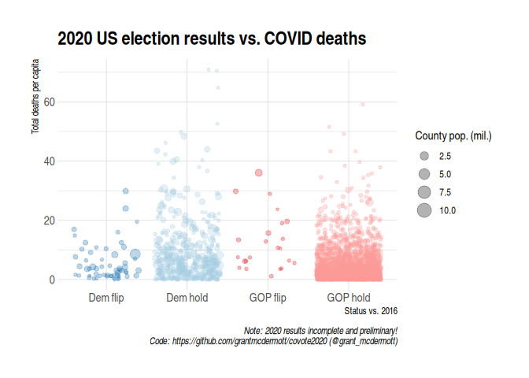
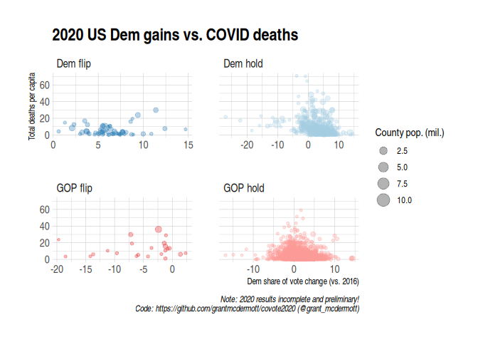
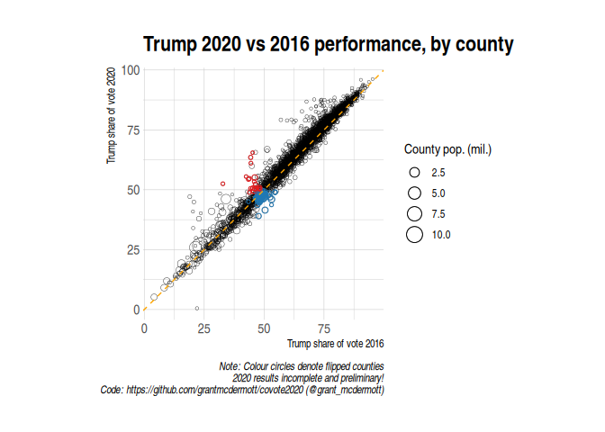

<!-- README.md is generated from README.Rmd. Please edit that file -->

# 2020 election vs COVID-19 outcomes

<!-- badges: start -->
<!-- badges: end -->

Consider this a “sister” repo to my [**covote**
repo](https://github.com/grantmcdermott/covote) (the latter being
focused on the 2016 election). The analysis here is based on preliminary
and incomplete data, but should become increasingly accurate as vote
tallies are finalised.

The below scripts were most recently run at **2020-11-05 11:55:08**.

### Libraries

You will need the follow R libraries.

    # Libraries ---------------------------------------------------------------

    library(tidycensus)
    library(data.table)
    library(ggplot2)
    theme_set(hrbrthemes::theme_ipsum())

### Other data

We start with some other (i.e. non-2020 election) data, which we’ll
cache to save having to re-download later.

    # 2016 election data ------------------------------------------------------

    ## Counties (Source: https://github.com/tonmcg/US_County_Level_Election_Results_08-16)
    e16 = fread('https://raw.githubusercontent.com/tonmcg/US_County_Level_Election_Results_08-16/master/2016_US_County_Level_Presidential_Results.csv')
    e16[, fips := sprintf('%05d', combined_fips)]

    # COVID-19 data -----------------------------------------------------------

    ## Source: NY Times COVID-19 data repo: https://github.com/nytimes/covid-19-data
    nytc = fread('https://raw.githubusercontent.com/nytimes/covid-19-data/master/us-counties.csv')
    nytc[, fips := sprintf('%05d', fips)]
    ## Limit data to pre-election period (only if rerunning code later)
    nytc = nytc[date <= '2020-11-03']

    # Demographics (population) -----------------------------------------------

    ## NOTE: This section assumes that you have already set your Census API key.
    ## See: https://walker-data.com/tidycensus/articles/basic-usage.html

    fips_pop = get_acs(geography = "county", variables = "B01003_001", cache_table = TRUE)
    setDT(fips_pop)
    fips_pop = fips_pop[, .(fips = GEOID, pop = estimate)]
    fips_pop[, fips := as.character(fips)]

## 2020 election data

Next, the 2020 election data. **NOTE: Again, these data should be
considered incomplete and preliminary!**

    # 2020 election data (preliminary!!) --------------------------------------

    ## Source: Fox (county-level)

    e20 = fread('https://feeds-elections.foxnews.com/archive/politics/elections/2020/3/President/county-level-results/feed_slimmer.csv', fill = TRUE)

    e20[, tot_votes := rowSums(.SD, na.rm = TRUE), .SDcols = seq(from=4, to=ncol(e20), by = 2)]
    e20 = e20[, c(1, 3, 4, 6, ncol(..e20))]
    names(e20) = c('fips', 'switch', 'can1', 'can2', 'tot_votes')

    # Account for terrible CSV formatting (https://github.com/grantmcdermott/covote2020/pull/1)
    e20[, ':=' (gop = fcase(switch == 1, can1, switch == 0, can2), 
                            dem = fcase(switch == 0, can1, switch == 1, can2))]
    e20[, c('switch', 'can1', 'can2') := NULL]

    e20[, ':=' (perc_dem20 = round(dem / tot_votes * 100, 1), 
                            perc_gop20 = round(gop / tot_votes * 100, 1))]
    e20[, fips := sprintf('%05d', fips)]

## Merge

Now we merge everything.

    # Merge everything --------------------------------------------------------

    ## Merge COVID and population data
    nytc = merge(nytc, fips_pop, by = 'fips')

    ## Create summary data frame with meaningful(?) COVID measures by county
    ecov20 = nytc[, 
                                .(pop = first(pop), 
                                    deaths_pc = round(sum(deaths/pop)*100, 2),
                                    max_cases_pc = round(max(cases/pop)*100, 2)), 
                                by = fips]
    ## Add "recent" COVID case data
    ecov20 = merge(ecov20,
                                 nytc[, .(oct_cases_pc = round(mean(cases/pop)*100, 2)), by = fips], 
                                 by = 'fips')

    ## Merge with 2020 election data
    ecov20 = merge(e20, ecov20, by = 'fips')

    ## Merge with 2016 election data
    ecov20 = merge(ecov20, 
                                 e16[, .(perc_dem16 = round(per_dem*100, 1), perc_gop16 = round(per_gop*100, 1), fips)], 
                                 by = 'fips')

    ## Add some extra columns
    ecov20[, ':=' (dem_change = perc_dem20 - perc_dem16, 
                                 gop_change = perc_gop20 - perc_gop16)]
    ecov20[, flipped := fcase(perc_dem20 > perc_gop20 & perc_dem16 > perc_gop16, 'Dem hold',
                                                        perc_dem20 < perc_gop20 & perc_dem16 < perc_gop16, 'GOP hold',
                                                        perc_dem20 > perc_gop20 & perc_dem16 < perc_gop16, 'Dem flip',
                                                        perc_dem20 < perc_gop20 & perc_dem16 > perc_gop16, 'GOP flip'
                                                        )]

## Plots

Plot time.

    # Plots -------------------------------------------------------------------

    flip_cols = c('Dem hold' = '#A6CEE3', 'Dem flip' = '#1F78B4', 
                                'GOP hold' = '#FB9A99', 'GOP flip' = '#E31A1C')

    ggplot(ecov20[!is.na(flipped)], 
                 aes(flipped, max_cases_pc, size = pop/1e6, col = flipped)) +
        geom_jitter(alpha = 0.3) +
        scale_size_continuous(name = 'County pop. (mil.)') +
        scale_colour_manual(values = flip_cols) +
        guides(colour = FALSE) +
        labs(title = '2020 US election results vs. max. COVID cases',
                 caption = 'Note: 2020 results incomplete and preliminary!\nCode: https://github.com/grantmcdermott/covote2020 (@grant_mcdermott)',
                 x = 'Status vs. 2016', y = 'Max. no. of cases per capita')

<!-- -->

    ggplot(ecov20[!is.na(flipped)], 
                 aes(flipped, oct_cases_pc, size = pop/1e6, col = flipped)) +
        geom_jitter(alpha = 0.3) +
        scale_size_continuous(name = 'County pop. (mil.)') +
        scale_colour_manual(values = flip_cols) +
        guides(colour = FALSE) +
        labs(title = '2020 US election results vs. recent COVID cases',
                 caption = 'Note: 2020 results incomplete and preliminary!\nCode: https://github.com/grantmcdermott/covote2020 (@grant_mcdermott)',
                 x = 'Status vs. 2016', y = 'Recent mean cases per capita')

<!-- -->

    ggplot(ecov20[!is.na(flipped)], 
                 aes(flipped, deaths_pc, size = pop/1e6, col = flipped)) +
        geom_jitter(alpha = 0.3) +
        scale_size_continuous(name = 'County pop. (mil.)') +
        scale_colour_manual(values = flip_cols) +
        guides(colour = FALSE) +
        labs(title = '2020 US election results vs. COVID deaths',
                 caption = 'Note: 2020 results incomplete and preliminary!\nCode: https://github.com/grantmcdermott/covote2020 (@grant_mcdermott)',
                 x = 'Status vs. 2016', y = 'Total deaths per capita')

<!-- -->

    ggplot(ecov20[!is.na(flipped)], 
                 aes(dem_change, deaths_pc, size = pop/1e6, col = flipped)) +
        geom_jitter(alpha = 0.3) +
        scale_size_continuous(name = 'County pop. (mil.)') +
        scale_colour_manual(values = flip_cols) +
        guides(colour = FALSE) +
        labs(title = '2020 US Dem gains vs. COVID deaths',
                 caption = 'Note: 2020 results incomplete and preliminary!\nCode: https://github.com/grantmcdermott/covote2020 (@grant_mcdermott)',
                 x = 'Dem share of vote change (vs. 2016)', y = 'Total deaths per capita') +
        facet_wrap(~ flipped, scales = 'free_x')

<!-- -->

    ggplot(ecov20, 
                 aes(perc_gop16, perc_gop20, size = pop/1e6)) +
        geom_point(shape = 21, stroke = 0.2) +
        geom_point(data = ecov20[grepl('flip', flipped)], 
                             aes(col = flipped), shape = 21, stroke = 0.5) +
        geom_abline(intercept = 0, slope = 1, col = 'orange', lty = 2) +
        scale_size_continuous(name = 'County pop. (mil.)') +
        scale_colour_manual(values = flip_cols) +
        guides(colour = FALSE) +
        labs(title = 'Trump 2020 vs 2016 performance',
                 caption = 'Note: Colour circles denote flipped counties\n2020 results incomplete and preliminary!\nCode: https://github.com/grantmcdermott/covote2020 (@grant_mcdermott)',
                 x = 'Trump share of vote 2016', y = 'Trump share of vote 2016') 
    #> Warning: Removed 5 rows containing missing values (geom_point).

<!-- -->
